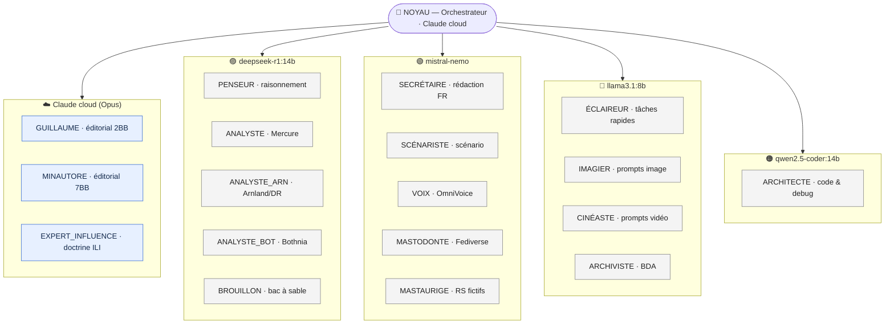
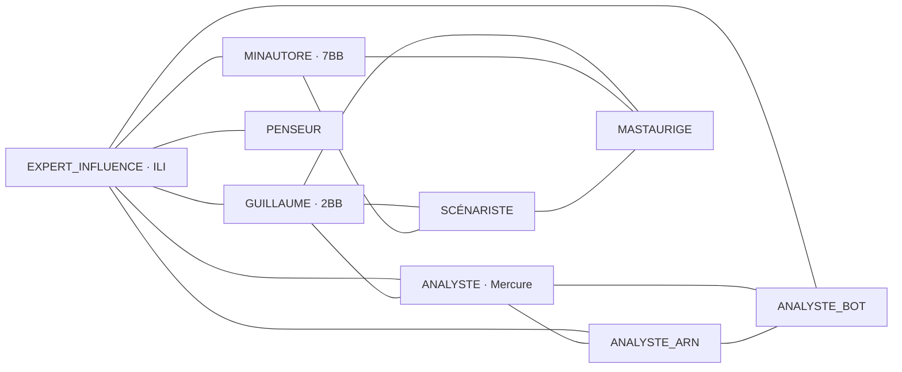

# 🏛️ MINERVE — Carte du système

> **MINERVE** = *Module Intelligent Numérique d'Effets, de Renseignement et de Veille pour l'Entraînement.*
> Point d'entrée du vault Obsidian. Cette note **ne duplique aucune donnée** (registre, rôles, modèles) — elle **renvoie** aux sources de vérité. Voir la règle « propriétaire unique » dans [CLAUDE.md](CLAUDE.md).

---

## 🗺️ Architecture du système (vue curated)

> Diagramme **dérivé** du registre de [CLAUDE.md](CLAUDE.md) (source de vérité). À régénérer si le registre change — ce n'est pas l'autorité.

### 1. Orchestration + co-résidence VRAM (par modèle Ollama)



### 2. Axe de collaboration éditorial (thématique « Collabore avec »)



---

## 📌 Sources de vérité (à ouvrir en premier)

- 📖 [CLAUDE.md](CLAUDE.md) — **source de vérité** : registre des agents, chemins, règles de cohérence
- 🧭 [SYSTEME/ROUTAGE.md](SYSTEME/ROUTAGE.md) — quel agent pour quelle tâche
- ⚙️ [SYSTEME/CONFIG.md](SYSTEME/CONFIG.md) — paramètres infra (modèles Ollama, chemins)
- 📋 [SYSTEME/DOSSIER_POSTE.md](SYSTEME/DOSSIER_POSTE.md) — règles de production
- 🔗 [CONVERGENCE/SYNTHESE.md](CONVERGENCE/SYNTHESE.md) — connaissances transversales
- 🗂️ [vault/INDEX.md](vault/INDEX.md) — **registre des notes atomiques** (couche méta « qui lie, ne copie jamais » : décisions, outils, leçons, archi, canvas + journal `daily/`). Règles de maintenance : [vault/CLAUDE.md](vault/CLAUDE.md).

---

## 🤖 Navigation par agent

> Liens de navigation uniquement (prompt système + mémoire). Le **registre canonique** (modèle, rôle, collaborations) reste dans [CLAUDE.md](CLAUDE.md).

| Agent | Prompt | Mémoire |
|---|---|---|
| NOYAU | [prompt](SYSTEME/PROMPTS/noyau.md) | [mémoire](NOYAU/MEMOIRE.md) |
| ARCHITECTE | [prompt](SYSTEME/PROMPTS/architecte.md) | [mémoire](ARCHITECTE/MEMOIRE.md) |
| PENSEUR | [prompt](SYSTEME/PROMPTS/penseur.md) | [mémoire](PENSEUR/MEMOIRE.md) |
| SECRÉTAIRE | [prompt](SYSTEME/PROMPTS/secretaire.md) | [mémoire](SECRETAIRE/MEMOIRE.md) |
| ÉCLAIREUR | [prompt](SYSTEME/PROMPTS/eclaireur.md) | [mémoire](ECLAIREUR/MEMOIRE.md) |
| IMAGIER | [prompt](SYSTEME/PROMPTS/imagier.md) | [mémoire](IMAGIER/MEMOIRE.md) |
| CINÉASTE | [prompt](SYSTEME/PROMPTS/cineaste.md) | [mémoire](CINEASTE/MEMOIRE.md) |
| SCÉNARISTE | [prompt](SYSTEME/PROMPTS/scenariste.md) | [mémoire](SCENARISTE/MEMOIRE.md) |
| VOIX | [prompt](SYSTEME/PROMPTS/voix.md) | [mémoire](VOIX/MEMOIRE.md) |
| ARCHIVISTE | [prompt](SYSTEME/PROMPTS/archiviste.md) | [mémoire](ARCHIVISTE/MEMOIRE.md) |
| ANALYSTE (Mercure) | [prompt](SYSTEME/PROMPTS/analyste.md) | [mémoire](ANALYSTE/MERCURE/MEMOIRE.md) |
| ANALYSTE_ARN | [prompt](SYSTEME/PROMPTS/analyste_arn.md) | [mémoire](ANALYSTE/ARNLAND/MEMOIRE.md) |
| ANALYSTE_BOT | [prompt](SYSTEME/PROMPTS/analyste_bot.md) | [mémoire](ANALYSTE/BOTHNIA/MEMOIRE.md) |
| MASTODONTE | [prompt](SYSTEME/PROMPTS/mastodonte.md) | [mémoire](MASTODONTE/MEMOIRE.md) |
| MASTAURIGE | [prompt](SYSTEME/PROMPTS/mastaurige.md) | [mémoire](MASTAURIGE/MEMOIRE.md) |
| GUILLAUME | [prompt](SYSTEME/PROMPTS/guillaume.md) | [mémoire](GUILLAUME/MEMOIRE.md) |
| MINAUTORE | [prompt](SYSTEME/PROMPTS/minautore.md) | [mémoire](MINAUTORE/MEMOIRE.md) |
| EXPERT_INFLUENCE | [prompt](SYSTEME/PROMPTS/expert_influence.md) | [mémoire](EXPERT_INFLUENCE/MEMOIRE.md) |
| BROUILLON | [prompt](SYSTEME/PROMPTS/brouillon.md) | [mémoire](BROUILLON/MEMOIRE.md) |

---

## 📊 Dashboards vivants (Dataview)

### 🕒 Fichiers récemment modifiés (top 15)

```dataview
TABLE WITHOUT ID file.link AS "Fichier", file.folder AS "Dossier", file.mtime AS "Modifié le"
FROM ""
WHERE file.name != "MINERVE_HOME"
SORT file.mtime DESC
LIMIT 15
```

### 🧠 État des mémoires d'agents (dernière mise à jour)

```dataview
TABLE WITHOUT ID file.folder AS "Agent", file.mtime AS "Dernière MAJ"
FROM ""
WHERE file.name = "MEMOIRE"
SORT file.mtime DESC
```

### 🗂️ Tous les prompts système

```dataview
LIST
FROM "SYSTEME/PROMPTS"
SORT file.name ASC
```

---

## 🔍 Réflexes de cohérence (cf. CLAUDE.md)

- **Camp d'un persona** → vérifier d'abord le registre [MASTAURIGE/MEMOIRE.md](MASTAURIGE/MEMOIRE.md) (+ `avatars.js`). Utilise le **panneau Backlinks** d'Obsidian sur le nom d'un personnage pour repérer toute divergence avant d'en ajouter une.
- **Doctrine pays** → l'Analyste du pays fait foi ([Mercure](ANALYSTE/MERCURE/MEMOIRE.md) · [Arnland/DR](ANALYSTE/ARNLAND/MEMOIRE.md) · [Bothnia](ANALYSTE/BOTHNIA/MEMOIRE.md)).
- **Doctrine ILI / synchromatrice** → [EXPERT_INFLUENCE/MEMOIRE.md](EXPERT_INFLUENCE/MEMOIRE.md).
- ⚠️ Ne **jamais renommer/déplacer** un `.md` depuis Obsidian — passer par Claude/git pour garder les renvois cohérents.
